N64RGBv2.1 (PCB)
---

This repository contains all you need files to build your own DIY N64RGBv2.1 board.
Firmware is supplied in another repository.

Please don't ask me for selling a modding.
I either sell some prototypes on some forums marketplaces (which is very unlikely) or I don't have any of the boards.
This is a complete DIY modding project.
So everybody is on his own here.

**WARNING:**
This is an advanced DIY project if you do everything on your own. You need decent soldering skills.
The CPLD and the video DAC have 0.5mm fine pitched pins.
On the board there are some SMD1206 resistor and ferrit bead arrays.
However, there are some awesome shops out there selling the boards for a great price.

## Table of Contents

- [Checklist](https://github.com/borti4938/n64rgb_pcb#checklist-how-to-build-the-project)
- [Assembly](https://github.com/borti4938/n64rgb_pcb#assembly)
- [Installation](https://github.com/borti4938/n64rgb_pcb#installation)
  - [1. Open the Console](https://github.com/borti4938/n64rgb_pcb#1-open-the-console)
  - [2. Optional Steps](https://github.com/borti4938/n64rgb_pcb#2-optional-steps)
  - [3. Solder Work](https://github.com/borti4938/n64rgb_pcb#3-solder-work)
  - [4. Mount the N64 Advanced Modding PCB](https://github.com/borti4938/n64rgb_pcb#4-mount-the-n64-advanced-modding-pcb)
  - [5. Finish the Work](https://github.com/borti4938/n64rgb_pcb#5-finish-the-work)
- [Jumper Setup](https://github.com/borti4938/n64rgb_pcb#jumper-setup)
- [Cable Setup](https://github.com/borti4938/n64rgb_pcb#cable-setup)

## Checklist: How to build the project

- Use PCB files (either [EAGLE-PCB design file](./n64rgbv2.1.kicad_pcb) or [Gerber files](./Gerber/)) to order your own PCB or simply use the [shared project(s) on OSHPark](https://oshpark.com/profiles/borti4938)
- If you paln to use solder paste, do not forget to order a stencil for top and bottom, too
- Source the components you need, e.g. from Mouser or Digikey.  
  The BOM is available in [here](./doc/BOM_n64rgbv2.1.xlsx).
- Wait for everything to arrive
- Assemble your PCB if you haven't use a PCBA service
- Set all jumpers
- Flash the firmware to the CPLD after installation (e.g. using an Altera USB Blaster)
  - Use the POF programming file named n64rgbv2\_1\__cpld-device_.pof
  - Using the IntelFPGA programmer, JTAG chain is initialized by loading POF file
  - N64 needs to be powered for flashing
  - Power cycle the N64 after flashing
- If you want to go for a clean installation with custom made flexible PCBs, just visit the repository for add ons ([Flex PCB for the digital video interface](https://github.com/borti4938/n64rgb_project_misc/RCP2N64RGB), [Flex PCB for the analog video output](https://github.com/borti4938/n64rgb_project_misc/N64RGB2MoutFilter)

## Assembly

If you have all components available, you can start assembly your board.
The documentation provides assembly sheets ([top](./doc/n64rgb2.1_assembly_sheet_top.pdf) and [bottom](./doc/1_assembly_sheet_bot.pdf), which you can print out.
Together with the [BOM](./doc/BOM_n64rgbv2.1.xlsx) it is just a matter of time and effort to assembly everything.
Alternatively you can also use the [interactive BOM](./doc/ibom.html).

Please note that the assembly (and component sourcing) depends on which kind of CPLD family you use.
Supported are Max II and Max V CLPDs.
- If you use a Max II CPLD, you have to use FB3 and leave U4, C41 and C42 unpopulated.
- If you use a Max V CPLD, you have to use U4, C41 and C42 and leave FB3 unpopulated.

If you populate J3, which is the JTAG connector, please short the pins such that they are flush at the bottom side.
This reduces the risk to short on of these pins with the heat sink (where the PCB will be mounted).

Using non-clean flux (rosin based) is obviously recommended.
Eventhough it is "non-clean" I recommend cleaning everything afterwards (just for the visual finish).

Please double check everything for shorts once you finished your work.
Very important is that the power supply trace do not short to GND.
- 3.3V against GND (e.g. at C1 and at C52)
- 1.8V against GND (e.g. at C42)
- 5V against GND (e.g. at C4)

## Installation

Note that installation pictures partially show the N64Advanced board.
Pad design and installation is equivalent.

### 1. Open the console

- Remove Jumper Pak / Expansion Pak
- Remove screws from bottom side of the console  
(needs a 4.5mm gamebit tool)
- Lift top housing
- remove inner screws as marked  
(in very last consoles made the heat sink design changed slightly)
- pull out the mainboard
- remove heat sink and RF shield
- **Hint** Now you have the chance to clean up your N64 shell

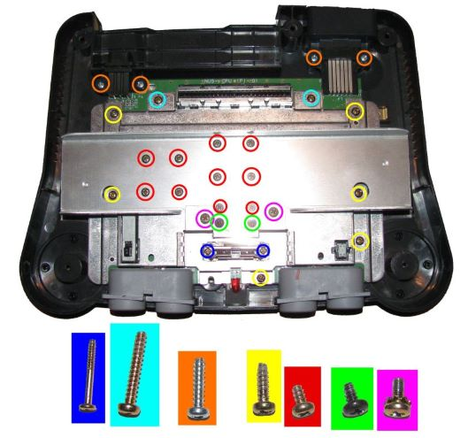
(image by Zerberus (circuit-board.de user))

### 2. Optional Steps

#### 2.1 Preparation of Top RF Shield

This step is optional.
It helps a) to reduce mechanical stress on the flex cable (if used) and b) ensures maximal distance between digital signals (installation wires or flex cable) and analog signals (MultiOut).

- Locate the tap in the RF shield next to the cartridge slot at the side of the MultiOut.  
(this is the place where the installation wires / flex cable will be routed through)
- option 1: bend the tap away

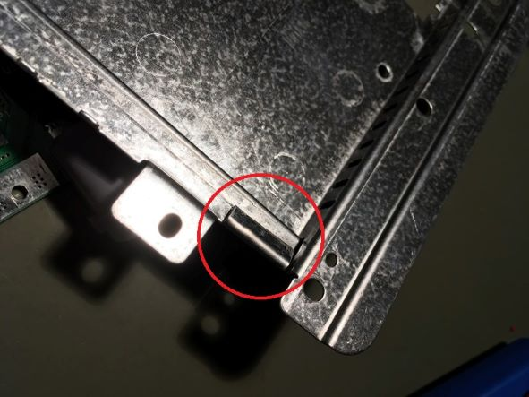

- option 2: simply cut the tab incl. the small piece up to the step in the RF shield

##### Some explanation on this optional step

Later, the data lines as well as the clock will be routed close to the MultiOut.
The distance between both is a crucial issue as your wires act as interferer.
Hence, having the tap bended might be ok, but it is better to cut some piece of the RF shield away to further increase the distance between MultiAV and data lines

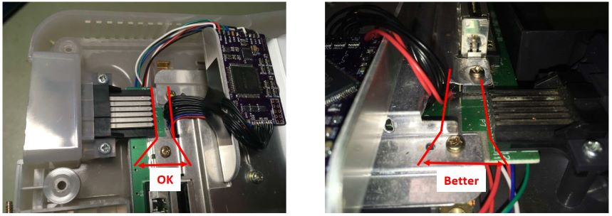

#### GND insulation on the MultiOut

In order to have a better return path for the digital video lines defined, you may insulate GND from the MultiOut.
This step is only recommended if you have a noisy picture.
It comes with the drawback that a) you have a lot of more effort during installation and b) having a longer return path for the analog audio output as well as for S-Video and Composte Video as GND is later routed over the modding board.

- desolder the MultiOut connector
- drill out the GND pads
- insulare the drilles (e.g. with varnish (flex cable or wire install) or small shrink tubes (only wire installation))
- solder MoultiOut back into place

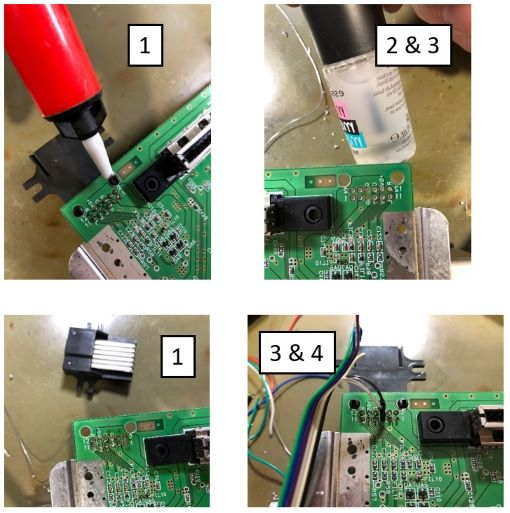

### 3. Solder Work

You have the options to either install everything with casual installation wires or using flex cables.
This is just a trade-off between personal installation effort and price.
Personally I recommend using the flex cable.

Sections 3.1 and 3.2 assume that you want to use the controller functions, so controller 1 will be connected.
However this is optional, yet at the flex install the controller pad of the flex cable must not be left open!
Please also note section 3.3, where the installation of mechanical switches is described.

#### 3.1 Using the Flex Cable 

To use this option, you have to have the flex cables as shown at hand.
Note that the picture shows older prototype version.

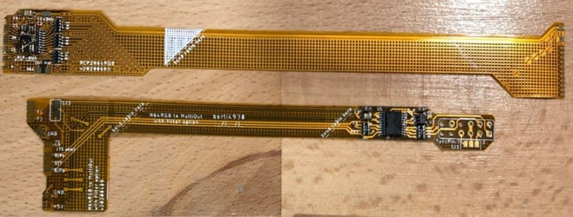

##### 3.1.1 Digital inputs

Start with the digital side:
- Solder the RCP connector side to the RCP-NUS as shown
  - first pin bottom – 8
  - last pin to – 28
- Connect 3.3V to the flex, e.g. taken from C141
- Connect Ctrl. and reset
  - reset from PIF-NUS pin 27
  - Controller from PIF-NUS pin 16  
  (Make sure that PIF-NUS pin 16 is connected to the middle pin of controller port 1, otherwise search for a suiteable connection point)
- bend the flex as marked in a way such that you do not see the shaded area anymore.  
The flex will be routed over the MultiOut.

**Note**: when using the flex of version earlier than _v2022xxyy_ you need to cut the RF shield near the MultiOut as shown in 2.1

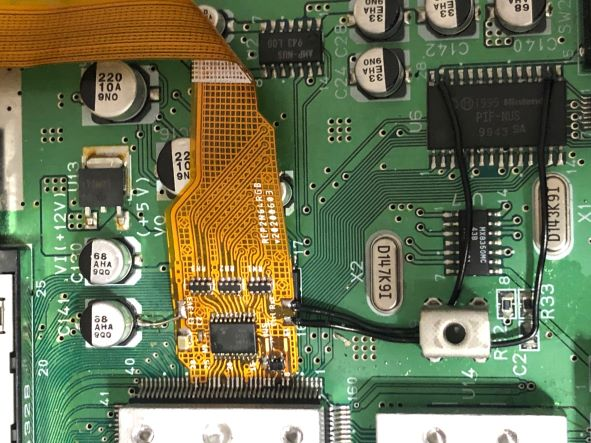

##### 3.1.2 Analog outputs

Next up is the analog video flex which will be connected to the MultiOut.
Before you start here, make yourself clear where you want to route sync to.
This depends on whether you want to use sync on luma or sync on composite sync (raw sync) cable.

- Free the sync pin from the MultiOut, which means that you have to trace back the copper track from the MultiOut pin and make sure that there is nothing connected to.
  - pin 3 (raw sync cable): usually unconnected. Only connected in earlier NTSC console (-CPU-01 to -CPU-03)
  - pin 7 (luma sync cable): usually connected. Search for a nearby resistor or trace back to the DENC-NUS or MAV-NUS and lift the luma pin. Remove the resistor or lift the pin at the DENC-NUS or MAV-NUS.
- solder the flex on its place of the MultiOut
- close **SJ1** on the flex from
  - middle to 3 if using raw sync
  - middle to 7 if using luma sync
- Note that it is also possible to connect sync pin 9 if you want to use a sync on composite video cable.
  - disconnect composite vide from pin 9 using the back tracing technique
  - solder a small wire from **SJ1** middle pad to pin 9 of the MultiOut

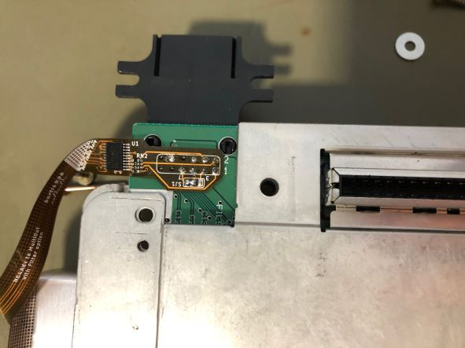

#### 3.2 Using Wires

First you need to work out the digital video signals as well as reset and controller 1. 
Most of the signals needed has to be taken from video processor output; the RCP-NUS.
Next to the RCP-NUS is the video encoder, where several types are used during the variety of N64 designs.
The pinouts are given below. Basically we need D0-D6, /DSYNC and /CLK (or VCLK or CLOCK) for the modding board.

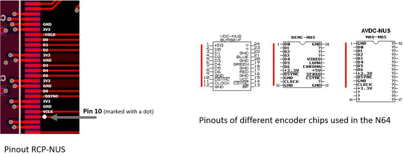
(RCP-NUS picture by Marshall; Encoder picture by Viletim)

Next to the video signals, you will need to get power (3.3V and GND), reset and controller 1.
This means you need in total 13 wires.
If you use a ribbon cable, I recommend you to use either a 15 conductor cable (double 3.3V and GND) or a 11 conductor cable and separate 3.3V and GND wires. 

- Locate the video encoder
  - Solder a bunch of wires to the video signal pins D0-D6, /DSYNC and /CLK
- Solder wires for reset and controller 1
  - reset from PIF-NUS pin 27
  - Controller from PIF-NUS pin 16  
  (Make sure that PIF-NUS pin 16 is connected to the middle pin of controller port 1, otherwise search for a suiteable connection point)
- Solder two addional wires for 3.3V (can be picked off C141) and one for GND (large GND plane)
- Route all wires to the MultiOut port

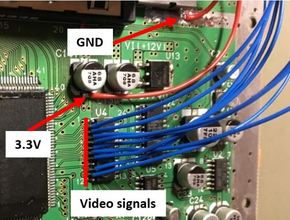

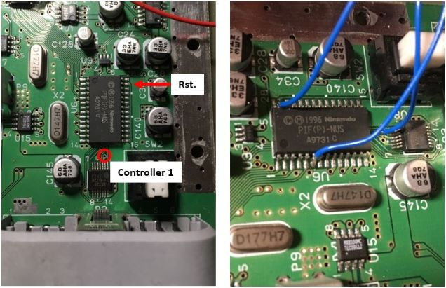

Next you can prepare wires for the analog video.
Connect several wires to the MultiOut.
Before you start here, make yourself clear where you want to route sync to.
This depends on whether you want to use a sync on composte video, a sync on luma or a sync on composite sync (raw sync) cable.

- Free the sync pin from the MultiOut, which means that you have to trace back the copper track from the MultiOut pin and make sure that there is nothing connected to.
  - pin 3 (raw sync cable): usually unconnected. Only connected in earlier NTSC console (-CPU-01 to -CPU-03)
  - pin 7 (luma sync cable): usually connected. Search for a nearby resistor or trace back to the DENC-NUS or MAV-NUS and lift the luma pin. Remove the resistor or lift the pin at the DENC-NUS or MAV-NUS.
  - pin 9 (compostie video sync cable): usually connected. Search for a nearby resistor or trace back to the DENC-NUS or MAV-NUS and lift the luma pin. Remove the resistor or lift the pin at the DENC-NUS or MAV-NUS.
- Prepare some wires to the following pins
  - pin 1: red
  - pin 2: green
  - pin 4: blue
  - pin 3, 7 or 9: sync
  - pin 5 and/or 6: GND (connect pin 5 **and** pin 6 if you insulated GND from the MultiOut)
  - pin 10: 5V

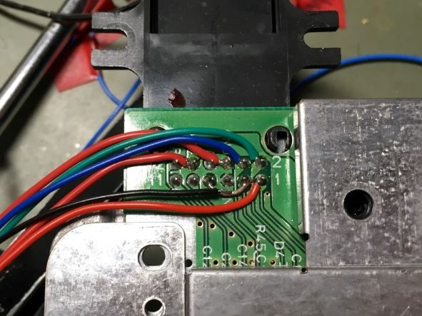

You have the option to use the FilterAddOn board here.
Note that the filter is optionally included in on the flex cable setup.

If you use the filter board, you clearly have to solder the filter board first and connect the wire to the pads of the filter board as marked on the silk screen.

#### 3.3 Mechanical switch

You can install mechanical switches to toggle VI-DeBlur on and off and also 16bit mode on and off.
At least I recommend to install a mechanical switch for the VI-DeBlur function.

Source a on/on or on/off switch like [this one](https://etim.net.au/shop/shop.php?crn=209&rn=559&action=show_detail).
If you source the switch as linked you can use [this 3D mount](https://www.thingiverse.com/thing:4584239) for a clean installation.

Connect the switch to J11.1 (VI-DeBlur) and/or to J11.2 (16bit mode) in a way such that the switch leaves the jumper open in one position and closes it at the other position.

  
### 4. Mount the N64 Advanced Modding PCB

The PCB is designed to fit on the heat sink of the N64.
There is a large via on the PCB where a M3 screw passes through.
Mount the PCB using a M3 screw of length 10mm or 12mm, a set of washer and a nut.
Be careful with the JTAG connector **J3** and ensure that the  pins do not short to the heatsink!

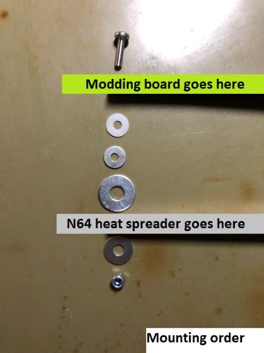

If you want to use the heat sink shield as an additional secure GND connection you can also apply some solder to the mounting via.

If everything is mounted and secured, the PCB should sit like that.

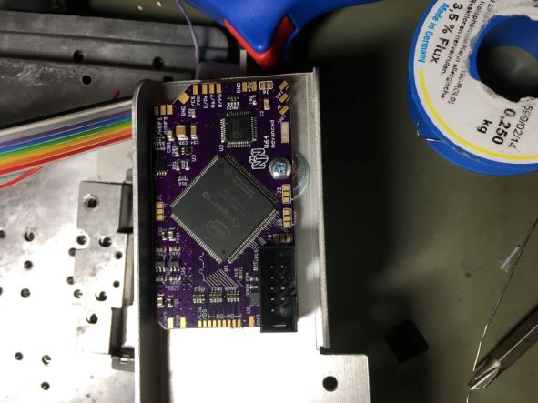

### 5. Finish the Work

Before continue you can assemble the RF shield and heat sink back to the N64 mainboard.
In that way everything is secured in place where it belongs to.
Of course, if you use an installation with wires, make sure that you know which wire is for what.
On my ealrier installs I used some wire marker.

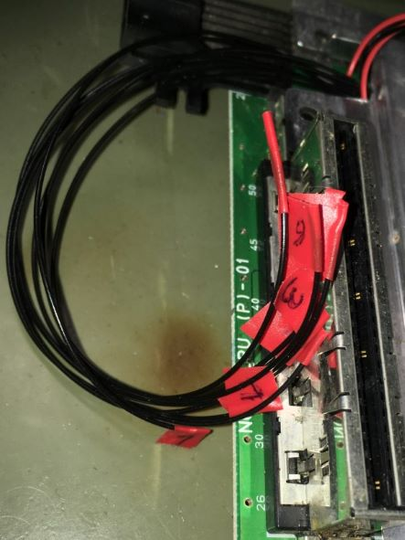

#### 5.1 With Flex Cable

Bend the flex cables gently at the shaded areas.
In that way you should be able to alling both flex cables at the N64 Advanced modding board.
Solder the flex cables at their places.
(Please note subsection 5.3 - CSYNC).

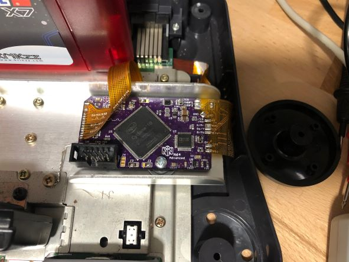

Connect an extra GND wire as shown in 5.3.

#### 5.2 With Wires

Just connect every wire at its place.
The silk screen shows you where everything goes to.
(Please note subsection 5.3 - CSYNC).
Note that the picture shows an older version of the N64 Advanced.
Newer versions have reset and controller at the left hand side.

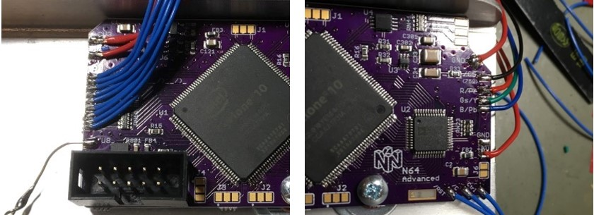

Connect an extra GND wire as shown in 5.4.

#### 5.3 CSYNC

You have the option to connect _/CS_ or _/CS (75ohm)_.
I recommend using _/CS (75ohm)_ except if you have a true TTL sink, which is usually not the case!
In virtually 99% of all setups connecting the sync wire to _/CS (75ohm)_ is the way to go.

On installations with the flex cables follows that you have to close SJ3 bottom on the flex.
Please note the Jumper Setup section to correctly setup the sync level.

#### 5.4 Extra GND Wire

Connect an extra GND wire to the heat sink screw.
This improves return path properies of the digital video lines.

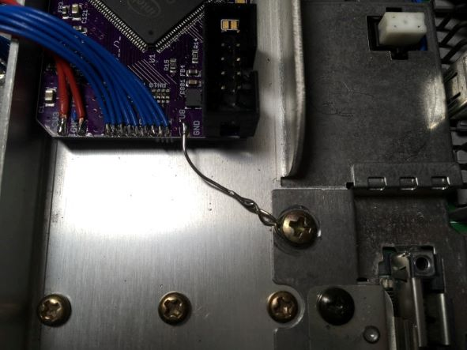

## Jumper Setup

Jumpers with three pads have _J1#.1_ and _J1#.2_, where .1 is marked with an _arrow_.
Closing either jumper means that a short to the middle pad is needed.

#### J11 (VI-DeBlur and 16bit mode)

This jumper can act as a power cycle default.
You can also switch the state of the jumper using a mechanical switch to toggle the functions during runtime.

##### J11.1 
- opened: VI-DeBlur off
- closed: VI-DeBlur on

##### J11.2
- opened: 16bit mode off
- closed: 16bit mode on

#### J12 (IGR function control)
##### J12.1 (VI-DeBlur and 16bit mode)
- opened: controller functions for toggle VI-DeBlur and 16bit mode on/off  are enabled
- closed: controller functions are disabled

##### J12.2 (in game reset)
- opened: reset by controller enabled
- closed: reset by controller disabled

#### J2 (Filter setup)
Needs filter add on to be installed.

- opened: use low pass filter
- closed: bypass filter

#### J21 (Sync on Green)
- open: SoG disabled
- closed: SoG enabled

#### J31 (CSYNC level @ _/CS (75ohm)_ pad)

- opened: appr. 1.87V @ 75ohm termination i.e. needs a resistor inside the sync wire further attenuating the signal. Designed to work for cables with 470 ohm resistor inside resulting in appr. 450mV @ 75ohm termination
- closed: appr. 300mV @ 75ohm termination suitable for pass through wired cables at sync, works with standard TV / scaler setup

#### J3
_J3_ is the JTAG connector.

## Cable Setup

| Signal | Pin MultiOut | Pin SCART | Ref. GND in SCART | Cinch Plug | Note |
|:-------|:-------------|:----------|:------------------|:-----------|:-----|
| Red / Pr | 1 | 15 | 13 | Red plug | Using a 220uF cap in series is possible |
| Green / Y | 2 | 11 | 9 | Green plug | Using a 220uF cap in series is possible |
| Blue / Pb | 4 | 7 | 5 | Blue plug | Using a 220uF cap in series is possible |
| Sync | 3, 7 or 9 | 20 | 17 | _not needed_ | Pin: See installation, Cable: see notes below |
| GND | 5, 6 | 4,5,9,13,17,18,21 | | Outer ring of each plug | Pin 21 @ SCART: outer shield |
| +5V | 10 | 16 | 18 | _not needed_ | SCART: use a 180ohm resistor in series |
| Audio left | 11 | 6 | 4 | Red plug | |
| Audio right | 12 | 2 | 4 | White plug | |

#### Notes on Sync:

- I recommend using the 75ohm compatible csync output.  
  You have a modding board with J31, you can select with J31 whether
  - you have a series resistor in you cable (J31 open) or
  - if you have a straightly wired sync connection (J31 closed).
- If you use TTL sync output, you have to add an additional resistor in series in every case if you want to use the cable on a non-TTL setup (0ohm to 900ohm) to attenuate the signal for 75ohm terminationed sinks.

#### RGB cables:

- If you buy an RGB cable, buy a typical RGB cable for a NTSC SNES with sync on luma (MultiAV pin 7) or sync on csync (MultiAV pin 3).
- If you bought a raw csync cable and if you use the 75ohm output, please ensure to set J31 correctly
  
#### PAL RGB cables (SNES PAL):

- PAL RGB cable, i.e. a cable with additional 75ohm resistors to GND, are not supported out of the box.
- You can support them if and only if you have the _Filter AddOn_.  
  To support the cable, replace RN2 with a 39ohm resistor array or solder a second 75ohm resistor array on top of the existing one.

#### RGsB Cables (Cinch):

With the given table you should be able to build your own component cable (passing RGB) or to build an adapter (see pictures below)
Unfortunately, there are no cables / adapter to buy.
Only chance is to buy a Wii component cable and use a MultiOut adapter (SNES/N64/GC style to Wii style).
